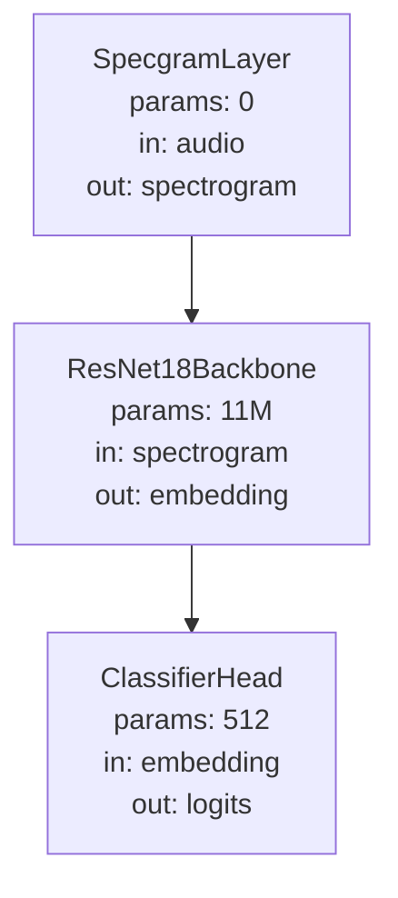

# Pipeline diagrams

`nexuml build` and `nexuml train` can both generate Mermaid flowcharts from a compiled pipeline. The diagram shows layers, tensor keys, and parameter counts.

## Generate a diagram

### Via `nexuml build`

```bash
nexuml resolve my-scenario          # writes configs/my-scenario.yaml
nexuml build configs/my-scenario.yaml
```

The Mermaid source is printed to stdout. If `logging.diagram.enabled=true`, it is also saved to `logging.diagram.output_dir/<scenario>.md`.

### Via `nexuml train`

When `logging.diagram.enabled=true` in the scenario, training automatically exports the diagram to `output_dir` after the compile step. No separate `build` call is needed.

## Example diagram



## Rendering

The diagram above is rendered by [Mermaid.js](https://mermaid.js.org/) inside Material for MkDocs. In the docs site, all `mermaid` fenced code blocks render as interactive SVGs.

To render locally without the docs site:

```bash
# Install mermaid-cli
npm install -g @mermaid-js/mermaid-cli
mmdc -i diagram.mmd -o diagram.svg
```

## DiagramSpec configuration

Diagram settings live under `logging.diagram` in your scenario:

```python
from nexuml.core.types import LoggingSpec, DiagramSpec

ScenarioSpec(
    name="my_scenario",
    logging=LoggingSpec(
        diagram=DiagramSpec(
            enabled=True,        # auto-generate on build
            depth=2,             # nesting levels (1 = stages only, 2 = stages + layers)
            direction="TB",      # "TB" (top-down) or "LR" (left-right)
            show_params=True,    # display parameter counts
            show_shapes=True,    # label edges with tensor shapes
            show_metrics=True,   # include metric layers
            output_dir=".experiments/diagrams",
        )
    ),
)
```

When `enabled=True`, `nexuml build` writes `<output_dir>/<scenario_name>.md` containing an embedded Mermaid flowchart. If diagram generation fails for any reason, the build continues with a warning — it never breaks compilation.

## See also

- [`nexuml.core.diagram`](../reference/api/nexuml/core/diagram.md)
- [Architecture](architecture.md)
