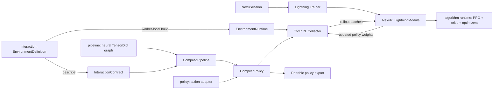

# Reinforcement learning and Physical AI

RL uses the ordinary `NexuSession` and Lightning trainer. TorchRL supplies collection,
GAE and clipped PPO losses; NexuML does not add another trainer.

## Ownership and mental model



- **`pipeline`** is the trainable neural graph. Its existing `forward(x, y)` contract is unchanged.
- **`policy`** turns neural outputs into valid actions. `CompiledPolicy` combines the graph,
  adapter and portable I/O contract. Gaussian inference uses a bounded transform;
  categorical inference chooses a mode or samples. Both use base PyTorch for deployment.
- **`interaction`** describes observations/actions and owns environment definitions, not live handles.
  Field shapes exclude batch dimensions; dtype, modality, bounds and control rates are explicit.
  `describe()` never connects to ROS/CARLA. Gymnasium may briefly probe spaces and immediately close.
- **`training`** selects learning semantics. PPO owns its critic, losses and optimizer configuration;
  Lightning owns precision, optimization execution and checkpoints.
- **Live environments/collectors** are built at execution sites, consumed through an iterable with
  `batch_size=None, num_workers=0`, and shut down on completion or failure. Remote collectors
  receive definitions/factories, not live simulator handles.

`total_frames` is the finite budget; `frames_per_batch` is the rollout batch size.
PPO `update_epochs` repeats updates within a batch, not dataset epochs. Batch boundaries
can round the final frame count. Evaluation builds a fresh environment and reports episode
return mean/std, mean length, termination and truncation counts. Set
`interaction.evaluation_environment` to override the evaluation definition.

## Fast CPU run

```bash
uv pip install -e ".[reinforcement]" -e "./library[reinforcement]"
nexuml train pendulum-ppo -O training.total_frames=32 -O training.frames_per_batch=16
nexuml train cartpole-ppo -O training.total_frames=32 -O training.frames_per_batch=16
```

For a tiny update/evaluation/export check:

```python
from pathlib import Path
from nexuml.core.export import export_package
from nexuml.core.types import RLEvaluationSpec
from nexuml.training.lightning import NexuSession
from nexuml_library.reinforcement.algorithms.ppo import PPO
from nexuml_library.scenarios.reinforcement.gymnasium import pendulum_ppo

spec = pendulum_ppo(total_frames=32, frames_per_batch=16)
spec.training.algorithm = PPO(update_epochs=1, minibatch_size=8)
spec.training.evaluation = RLEvaluationSpec(episodes=1, max_steps_per_episode=10)
result = NexuSession(spec, enable_loggers=False, enable_progress_bar=False).run()
export_package(result.policy, Path("artifacts/pendulum-policy"))
```

Use [resolved YAML](run-scenarios.md) and [trainer checkpoints](checkpoints.md) through
the existing CLI. For RL, deploy `result.policy`, not `result.pipeline`: raw Gaussian
parameters are not environment actions. The existing dataset-oriented `smoke` command
is not an RL acceptance path; use finite frame budgets or the tests below.

### Collection and placement

Direct collection and synchronous process collection are validated. Configure
`training.collector.backend="process"`, `num_collectors`, `num_envs_per_collector`
and `policy_sync_interval_batches` (default 1) for copied worker policies.
Environment/device topology and learner placement are separate concerns.

Synchronous CPU Ray collection is also validated with a local CPU learner. Install
`nexuml[reinforcement,ray]` and select `training.collector.backend="ray"`. Environment,
storage and policy devices must be CPU; `frames_per_batch` must be divisible by
`num_collectors * num_envs_per_collector`. The finite loader disables Lightning's
lookahead so synchronous rollouts follow learner updates and policy synchronization.

TorchRL 0.14 kills Ray actors without closing environments. A private, lazy teardown
repair closes remote collectors before actor termination, including iterator exhaustion.
It waits at most 30 seconds; failed/timed-out close still kills owned actors and releases
the runtime lease, then reports the error. Repeated teardown is safe. Caller-owned Ray
runtimes remain alive; collector-owned local runtimes stop after collection.

```bash
NEXUML_RUN_SYSTEM_TESTS=1 OMP_NUM_THREADS=1 MKL_NUM_THREADS=1 \
  python -m pytest tests/core/test_ray_collectors.py -q
```

The proof uses its own small local runtime, two CPU actors, worker-local environments,
copied-policy refresh and normal/failure/cancellation cleanup. Ray learner placement,
asynchronous/GPU Ray collection and nested learner/collector placement remain rejected.
Do not nest unvalidated Ray runtimes. ROS/CARLA reference runs use a single direct collector.

## Scenario and dependency matrix

| Scenario | Observation/action coverage | Execution prerequisites |
| --- | --- | --- |
| `pendulum-ppo` | vector / bounded continuous | `reinforcement` extras |
| `cartpole-ppo` | vector / categorical | `reinforcement` extras |
| `visual-cartpole-ppo` | uint8 CHW image / categorical | library `rendering` extra; SDL rendering |
| `mujoco-humanoid-ppo` | 45 proprioceptive values / 17 joint controls | library `mujoco` extra |
| `mujoco-reacher-ppo` | 10 proprioceptive values / 2 joint controls | library `mujoco` extra |
| `ros2-gazebo-joint-reach-ppo` | joint positions/velocities/target / bounded position targets | sourced ROS 2, Gazebo, `ros2_control`, reset hook |
| `carla-lane-following-ppo` | uint8 camera + ego state / steer, throttle, brake | matching CARLA client/server; rendering-capable simulator |

Optional scenario contracts compile and round-trip without starting simulators.
Execution diagnoses missing prerequisites; ROS never silently substitutes a fake transport.
MuJoCo is separate from base reinforcement. ROS, Gazebo, Isaac and CARLA are not base
Python dependencies. References exercise integration, not convergence or production autonomy.

```bash
uv pip install -e "./library[rendering,mujoco]"
NEXUML_RUN_SIMULATOR_TESTS=1 SDL_VIDEODRIVER=dummy \
  python -m pytest tests/core/test_simulation_scenarios.py -q
```

Humanoid uses Gymnasium v5 with optional inertial/contact-force observations disabled;
Reacher also uses v5. The visual reference consumes resized rendered pixels directly.
Small dense heads intentionally establish the I/O path, not a vision benchmark.

## ROS: fake, Gazebo, hardware

`Ros2JointReachEnvironment` contains reward and termination; `Ros2Transport` contains
only state reception, command publication, simulation reset and owned shutdown.
`RclpyTransport` uses a private context/executor/node and does not shut down another
application's global ROS context.

Normal tests inject `FakeRos2Transport` into the **same task runtime**. They cover
state ordering, position limits, commands, reset, timeout, success/time-limit signals
and shutdown. Production-transport tests reject stale samples by timestamp and
control-period arrival time:

```bash
python -m pytest tests/core/test_ros2_environment.py -m "not requires_system" -q
```

### Headless Gazebo integration contract

The opt-in fixture launches an **operator-provided simulation launch argv** and stops
only its own process group. NexuML does not install Gazebo or bundle a robot description.
Prepare a dedicated ROS 2 simulation (Jazzy/Harmonic or a compatible installation) with:

1. A simulated two-joint robot named `joint1`, `joint2`, with position limits `[-1, 1]`.
2. A running `ros2_control` joint-state broadcaster publishing `sensor_msgs/JointState`
   on `/joint_states`, including positions, velocities and valid simulation timestamps.
3. A joint trajectory controller subscribing to `trajectory_msgs/JointTrajectory` on
   `/joint_trajectory_controller/joint_trajectory`.
4. A `/reset_simulation` service of type `std_srvs/Empty` that completes the simulation
   reset before returning. Modern Gazebo's world-control service is **not** this service;
   the testbench must provide the reset bridge/hook.
5. `/clock` publication; the reference node uses `use_sim_time=True`. Keep all controllers
   and reset hooks in an isolated simulation-only ROS domain.

Source that ROS installation in a Python environment where both `rclpy` and NexuML
are importable. ROS's system Python ABI can differ from your usual virtual environment;
the reinforcement extra does not install or repair ROS middleware.

```bash
export NEXUML_ROS_GAZEBO_LAUNCH='["ros2","launch","YOUR_SIMULATION_PACKAGE","headless.launch.py"]'
NEXUML_RUN_SYSTEM_TESTS=1 python -m pytest tests/core/test_ros2_environment.py \
  -m requires_system -q
```

Replace the launch package/file with your testbench. The live test requires actual
joint movement toward the published target, then collects PPO rollouts and evaluates
using the production transport. Fake tests are not proof of ROS/Gazebo integration.

### Later hardware mapping

Hardware can expose the same high-level joint topics and a separately reviewed episode
initialization hook. Set `use_sim_time=False` for wall-clock hardware and configure
correct joint names, bounds, topics, period and timeouts. This is **not authorization to
run exploratory RL on a robot**: an operator must review the task and controller first.

Robot drivers, real-time servo loops, physical limits, collision protection, safety
interlocks and emergency stops remain below/outside NexuML. Configured action bounds
and a transport timeout do not establish physical safety. No normal or automatic CI
job targets hardware; validation is manual, isolated and operator-supervised.

## CARLA integration

Supply a dedicated, idle asynchronous CARLA server with rendering enabled and a matching
Python client built for the interpreter running NexuML (Python 3.12 or newer). Older
CARLA binary distributions may not offer that ABI; use a compatible client build rather
than adding an incompatible wheel to the reinforcement extra. The adapter uses CARLA's
0.9.x synchronous tick/camera/control API.

The adapter becomes the only tick owner, sets a bounded fixed step, creates its own
vehicle/camera/collision actors, matches camera and world frame numbers, and restores
original settings during shutdown. It neither reloads the map nor destroys other actors.
Do not run multiple collectors, an external tick client or Traffic Manager in this
reference server. For lane following, use an empty map with valid vehicle spawn points.

```bash
NEXUML_RUN_SYSTEM_TESTS=1 NEXUML_CARLA_HOST=127.0.0.1 NEXUML_CARLA_PORT=2000 \
  python -m pytest tests/core/test_carla_environment.py -m requires_system -q
```

The live smoke collects, updates, evaluates and exports a complete policy. Normal tests
use a fake server to verify lifecycle/control/frame wiring and simulator-free export.
Neither smoke test asserts that PPO solves driving. The local lane-center reward is a
reference task, not a route planner, traffic policy, or road-safety system.

Additional lidar/radar/GNSS/IMU inputs extend `InteractionContract.observations` with named
tensor fields, dtype, shape, modality and rate. Align them to the same simulator frame;
for variable-length point clouds, choose explicit padding/masks or an encoder contract.
Add consuming pipeline stages; the collector, algorithm and Lightning ownership stay
unchanged. These additional sensors are not implemented by this reference adapter.

## Portable policy versus local training state

`export_package(result.policy, path)` preserves pipeline weights, action-adapter state,
portable interaction metadata and resolved provenance. `load_package(path)` returns
`(policy, config, metadata)`; `load_inference_package(path)` loads packaged inference.
Both support observation TensorDict inference without building an environment or PPO.
The dependency manifest records referenced source imports, which can include lazy
training helpers; it is not a minimal list of inference-only dependencies.
Only load trusted packages: Python model packages are executable artifacts.

Normal policy artifacts exclude critics, optimizers, replay/rollouts, simulator state,
ROS/socket handles and collectors. The neural weights remain separately identifiable
in `state_dict.pt`. A Lightning resume checkpoint separately restores policy, PPO critic,
optimizers and frame/update counters; runtime resources are rebuilt. Collected experience
and simulator state are not resumed as live objects.

Future NexuFL should exchange **selected learned policy parameters** plus required
adapter/contract metadata, keeping raw camera/lidar/force observations, trajectories,
replay and runtime state local by default. Federated interactive training is not implemented.

`data` and `interaction` remain independent and may coexist: later imitation learning
could train on demonstrations and evaluate/fine-tune against the same environment;
VLA policies could consume camera/language/proprioception and emit action chunks; world
models could reuse observation/action contracts. This change implements none of those
training modes and adds no speculative trainer hierarchy for them.

## Test tiers and current proof

- **Default CPU/configuration:** fast Pendulum/CartPole, fake ROS/CARLA, policy
  export/resume and all static simulator contracts.
- **Optional simulators:** `requires_simulator` and `NEXUML_RUN_SIMULATOR_TESTS=1`.
  The CI workflow's `rl-simulators` manual input runs visual/MuJoCo smokes, not ROS/CARLA.
- **Special systems:** `requires_system` and `NEXUML_RUN_SYSTEM_TESTS=1`; Ray proofs start
  an isolated local runtime; install/configure ROS/Gazebo or CARLA explicitly.
  Pair with `requires_gpu` when a test needs a local GPU.
- **Hardware:** `requires_hardware` and `NEXUML_RUN_HARDWARE_TESTS=1`, manual only.
  No hardware test or automatic hardware job is provided by this change.

Visual/MuJoCo CPU smokes have run locally. ROS/Gazebo and live CARLA tests require an
external testbench/server and remain unverified until those integration runs succeed.
Normal CI does not download or boot those systems. See [Development setup](development.md)
for the repository's lint, type, docs and package gates.
