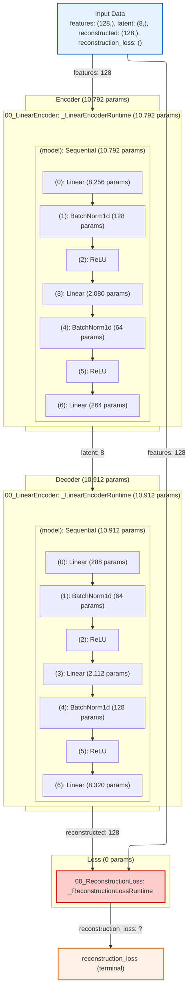

# Pipeline Diagram

```mermaid
---
config:
    layout: elk
---
flowchart TB
    data["`Input Data<br/>features: (128,), latent: (8,), reconstructed: (128,), reconstruction_loss: ()`"]:::input
    subgraph Encoder_1["Encoder (10,792 params)"]
        direction TB
        subgraph Encoder_00_LinearEncoder_2["00_LinearEncoder: _LinearEncoderRuntime (10,792 params)"]
            direction TB
            subgraph Encoder_00_LinearEncoder_2_model_0_3["(model): Sequential (10,792 params)"]
                direction TB
                Encoder_00_LinearEncoder_2_model_0_3__0_0_4["`(0): Linear (8,256 params)`"]
                Encoder_00_LinearEncoder_2_model_0_3__1_1_5["`(1): BatchNorm1d (128 params)`"]
                Encoder_00_LinearEncoder_2_model_0_3__2_2_6["`(2): ReLU`"]
                Encoder_00_LinearEncoder_2_model_0_3__3_3_7["`(3): Linear (2,080 params)`"]
                Encoder_00_LinearEncoder_2_model_0_3__4_4_8["`(4): BatchNorm1d (64 params)`"]
                Encoder_00_LinearEncoder_2_model_0_3__5_5_9["`(5): ReLU`"]
                Encoder_00_LinearEncoder_2_model_0_3__6_6_10["`(6): Linear (264 params)`"]
                Encoder_00_LinearEncoder_2_model_0_3__0_0_4 --> Encoder_00_LinearEncoder_2_model_0_3__1_1_5
                Encoder_00_LinearEncoder_2_model_0_3__1_1_5 --> Encoder_00_LinearEncoder_2_model_0_3__2_2_6
                Encoder_00_LinearEncoder_2_model_0_3__2_2_6 --> Encoder_00_LinearEncoder_2_model_0_3__3_3_7
                Encoder_00_LinearEncoder_2_model_0_3__3_3_7 --> Encoder_00_LinearEncoder_2_model_0_3__4_4_8
                Encoder_00_LinearEncoder_2_model_0_3__4_4_8 --> Encoder_00_LinearEncoder_2_model_0_3__5_5_9
                Encoder_00_LinearEncoder_2_model_0_3__5_5_9 --> Encoder_00_LinearEncoder_2_model_0_3__6_6_10
            end
        end
    end
    subgraph Decoder_11["Decoder (10,912 params)"]
        direction TB
        subgraph Decoder_00_LinearEncoder_12["00_LinearEncoder: _LinearEncoderRuntime (10,912 params)"]
            direction TB
            subgraph Decoder_00_LinearEncoder_12_model_0_13["(model): Sequential (10,912 params)"]
                direction TB
                Decoder_00_LinearEncoder_12_model_0_13__0_0_14["`(0): Linear (288 params)`"]
                Decoder_00_LinearEncoder_12_model_0_13__1_1_15["`(1): BatchNorm1d (64 params)`"]
                Decoder_00_LinearEncoder_12_model_0_13__2_2_16["`(2): ReLU`"]
                Decoder_00_LinearEncoder_12_model_0_13__3_3_17["`(3): Linear (2,112 params)`"]
                Decoder_00_LinearEncoder_12_model_0_13__4_4_18["`(4): BatchNorm1d (128 params)`"]
                Decoder_00_LinearEncoder_12_model_0_13__5_5_19["`(5): ReLU`"]
                Decoder_00_LinearEncoder_12_model_0_13__6_6_20["`(6): Linear (8,320 params)`"]
                Decoder_00_LinearEncoder_12_model_0_13__0_0_14 --> Decoder_00_LinearEncoder_12_model_0_13__1_1_15
                Decoder_00_LinearEncoder_12_model_0_13__1_1_15 --> Decoder_00_LinearEncoder_12_model_0_13__2_2_16
                Decoder_00_LinearEncoder_12_model_0_13__2_2_16 --> Decoder_00_LinearEncoder_12_model_0_13__3_3_17
                Decoder_00_LinearEncoder_12_model_0_13__3_3_17 --> Decoder_00_LinearEncoder_12_model_0_13__4_4_18
                Decoder_00_LinearEncoder_12_model_0_13__4_4_18 --> Decoder_00_LinearEncoder_12_model_0_13__5_5_19
                Decoder_00_LinearEncoder_12_model_0_13__5_5_19 --> Decoder_00_LinearEncoder_12_model_0_13__6_6_20
            end
        end
    end
    subgraph Loss_21["Loss (0 params)"]
        direction TB
        Loss_00_ReconstructionLoss_22["`00_ReconstructionLoss: _ReconstructionLossRuntime`"]:::loss
    end
    data --> |features: 128| Encoder_00_LinearEncoder_2
    Encoder_00_LinearEncoder_2 --> |latent: 8| Decoder_00_LinearEncoder_12
    data --> |features: 128| Loss_00_ReconstructionLoss_22
    Decoder_00_LinearEncoder_12 --> |reconstructed: 128| Loss_00_ReconstructionLoss_22
    terminal_reconstruction_loss_23["`reconstruction_loss (terminal)`"]:::terminal
    Loss_00_ReconstructionLoss_22 --> |reconstruction_loss: ?| terminal_reconstruction_loss_23
    classDef loss fill:#ffcccc,stroke:#cc0000,stroke-width:2px
    classDef metric fill:#ccccff,stroke:#0000cc,stroke-width:2px
    classDef input fill:#e6f3ff,stroke:#0066cc,stroke-width:2px
    classDef terminal fill:#fff0e6,stroke:#cc6600,stroke-width:2px
```
